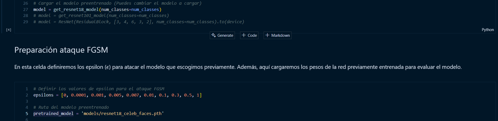
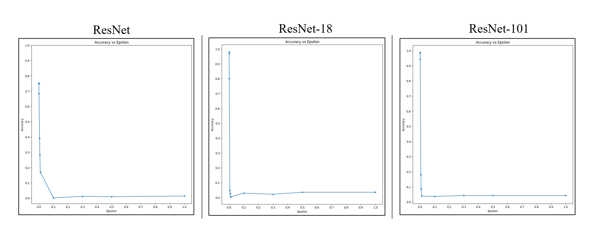
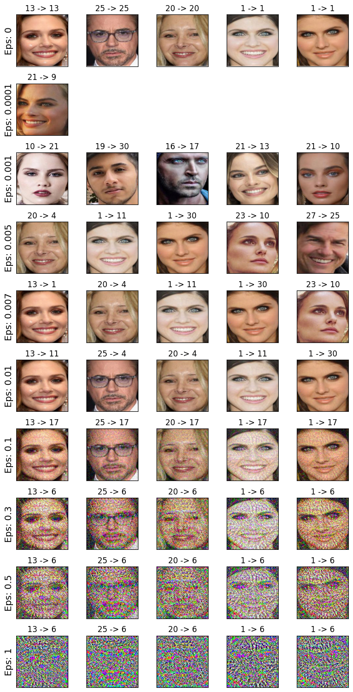

# Proyecto ML for Engineering - Grupo 1

## Integrantes
- Juan Camilo Rojas Hernández (202121526)  
- Sergio Andrés Canar Lozano (202020383)  
- Wilman Sánchez Hernández (202116779)  

---

# Machine Learning Adversarial: **Fast Gradient Sign Method (FGSM) en el Reconocimiento de Rostros**

## Preparación del repositorio

Para usar este repositorio, es necesario que descargues los datos y los pesos del modelo a utilizar para el **FGSM**. Entonces, lo primero que deberás hacer es descargar los [datos](https://drive.google.com/drive/folders/1cZ_pz10iFS_ydMxQ8kpAqV5EbJ4wmbF_?usp=sharing) y descomprimirlos para que tengas la siguiente estructura de carpetas:

```
FGSM_faces/data/
 │
 ├───face_recognition
 │      ├──Faces
 │      │      └──Akshay Kumar_0.jpg
 │      │      └──Akshay Kumar_1.jpg
 │      │      └──...
 │      ├──Original Images
 │      │      └──Akshay Kumar
 │      │      └──Alexandra Daddario
 │      │      └──...
 │      ├──data_txt.txt
 │      ├──dataset_faces.csv
 │      ├──Dataset.csv
```

Ahora para los pesos de los modelos usados:

```
FGSM_faces/
 │
 ├───models
 │      └──resnet_celeb_faces.pth
 │      └──resnet18_celeb_faces.pth
 │      └──resnet101_celeb_faces.pth

```

**Todos los modelos fueron entrenados en una GPU Nvidia GeForce RTX 4060 de 8 Gb**.

## Utilizar el repositorio

El archivo que contiene la implementación del **FGSM** es `Grupo1_FGSM.ipynb`. Al ejecutar este archivo, encontrarás una descripción detallada sobre el funcionamiento de este método de *Machine Learning Adversarial*, así como una visión general de la importancia de esta área de investigación en *Machine Learning* e *Inteligencia Artificial*.

Para realizar el ataque FGSM con un modelo diferente, deberás modificar dos variables: `model` y `pretrained_model`. Estas variables definen el modelo que será sometido al ataque. Puedes cambiarlas según el modelo que desees probar, pero asegúrate de que los modelos y sus pesos coincidan para evitar errores al cargar los pesos. A continuación, te mostramos la sección del código donde deberás realizar estos cambios.

<div style="text-align: center;">
  
</div>

Listo! Eres libre de experimentar los epsilons y modelos que desees para entener el FGSM

### Resultados

Estos son los resultados que obtuvimos en los 3 modelos que probamos, en estos se ve el efecto del epsilon ($\epsilon$) en el desempeño del modelo, mostrando así la importancia de estudiar la vulnerabilidad de los modelos de ML y IA.

<div style="text-align: center;">
  
</div>

Ahora, estos son los resultados cualitativos de nuestro proyecto, aquí se aprecia una mínima perturbación en las imágenes de entrada hace que el modelo genere predicciones incorrectas.

<div style="text-align: center;">
  
</div>

### Análisis

Como podemos observar, en los tres modelos, a medida que ϵ aumenta, la precisión disminuye drásticamente, empezandoen los valores bajos de ϵ. Esto indica que los modelos son sensibles incluso a pequeñas perturbaciones en los datos de entrada. De hecho, al mirar los resultados cualitativos, podemos ver que desde un ϵ de 0.0001 empiezan a haber malas clasificaciones de los rostros, lo cual incrementa a medida que se aumenta el épsilon. Esta baja tolerancia en los modelos ante perturbaciones pequeñas hace que se vuelvan mucho menos efectivos frente a ataques adversariales o ruido. De hecho, es relevante notar que todos los modelos evaluados comparten una alta vulnerabilidad frente a perturbaciones adversariales, ya que, incluso las arquitecturas más complejas, como ResNet-101, no muestran ventajas significativas frente a ResNet-18 o la versión base en términos de resistencia a estos ataques.

Este pequeño análisis resalta la importancia de implementar estrategias para mejorar la robustez de los modelos frente a ataques adversariales, ya que gran parte de estos modelos son los que se utilizan en aplicaciones críticas de la vida real, como la detección de enfermedades en imágenes médicas, la conducción autónoma, la seguridad en sistemas de vigilancia y el procesamiento de datos financieros.
